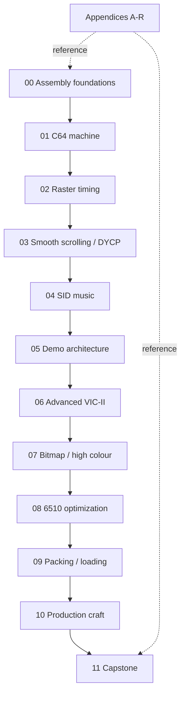

# Prerequisite graph

The course is deliberately linear at the block level while individual lessons may refer back to earlier concepts.



## Dependency policy

- A learner may explore ahead, but labs can assume completed prerequisite blocks.
- Appendices are references, not prerequisite courses.
- EduCPU is optional deeper background and is **not** a C64 Codecraft prerequisite.
- Tool knowledge should be introduced when needed; no editor extension is a prerequisite.
- Advanced timing examples must state target machine/video assumptions.

## Lesson metadata

New lessons should use frontmatter fields such as:

```yaml
title: ...
course: ...
lesson: ...
level: ...
prerequisites: [...]
labs: [...]
```

The consistency tooling can become stricter as older lessons are normalized to this schema.
